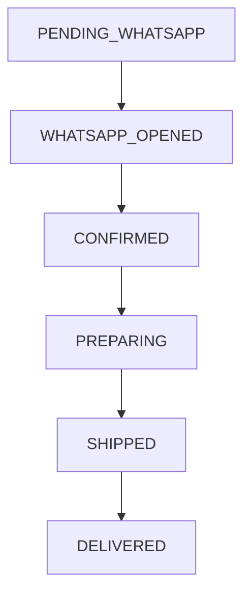
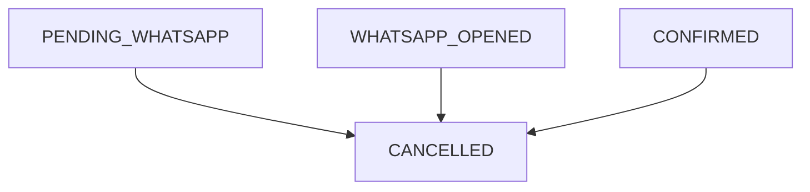

# SERENA INTIMATES — ORDER LIFECYCLE V1

This document defines the lifecycle states and transitions for the Serena Intimates Order Management engine.

## Allowed Transitions

### Happy Path (Fulfillment Flow)

### Unhappy Path (Cancellation Flow)

## State Explanations

- **`PENDING_WHATSAPP`**: The user clicked "Confirmar pedido" on the checkout form, and the order was saved in Supabase. The system is attempting to open the WhatsApp window. Stock is temporarily reserved for 24 hours.
- **`WHATSAPP_OPENED`**: The browser successfully opened the WhatsApp window, or the user manually clicked the fallback "Abrir WhatsApp" button. The customer's cart is explicitly cleared at this point.
- **`CONFIRMED`**: A sales representative verified the bank transfer or cash payment and confirmed the order is valid. The stock reservation becomes permanent.
- **`PREPARING`**: The physical items are being gathered, packed, and assigned a shipping label in the warehouse.
- **`SHIPPED`**: The package has been handed over to the courier (delivery) or is ready at the store (pickup). Tracking numbers are typically provided here.
- **`DELIVERED`**: The customer has successfully received the product. This is a terminal state.
- **`CANCELLED`**: The order was abandoned (exceeded 24h expiration), stock was unavailable, or the user requested a cancellation. Stock is returned to available inventory. This is a terminal state.
